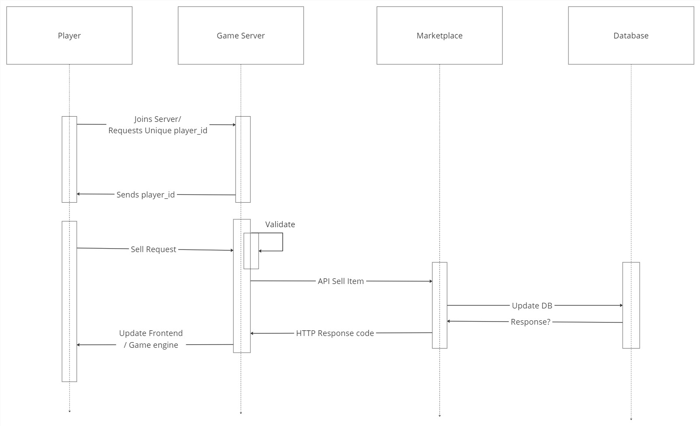

# Marketplace

- User interacts with only the backend via API calls.
- This allows for a single user login to manage the database. Useful for scalability
- Reduce risk of SQL injection attack.
- Can perform business logic (maybe check player funds) before executing query. 
- Reduce number of queries to the database since we can check via buisness logic.